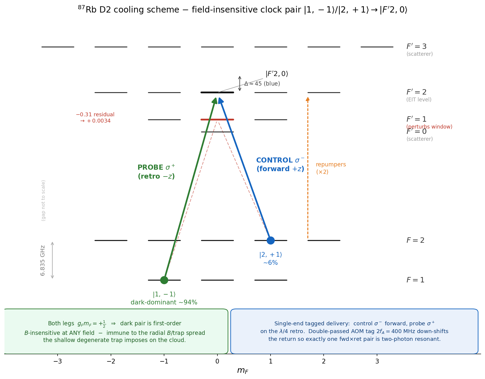
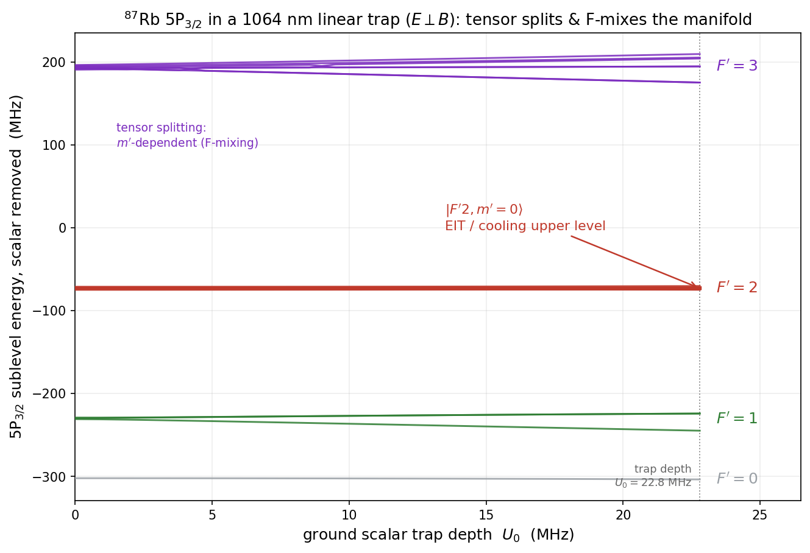

# Clock-EIT Sideband Cooling of ⁸⁷Rb in a 1064 nm Kagome-HCPCF Lattice
## Consolidated technical state and the conceptual path that produced it

**Version 17.** Three additions, all this session; the v16 conclusions are unchanged. (i) The delivery axis (§4) is paired with a **radial-coverage axis** — one cooling tone vs two — into the **four-subversion matrix** {A,B,C,D}, with the tone count chosen by radial temperature at a **crossover T_r ≈ 120 µK** (§8). (ii) The §8 flat-top result is **confirmed dynamically** by an independent box-profile Monte-Carlo: a *finite* flat-top with confining walls still collapses the cloud floor to ~on-axis for *every* T_r, via the **dead-wall mechanism** (off-axis atoms freeze rather than heat), and the realized dynamic floor sits 3–4× below the quasi-static gate *(the ~on-axis-for-every-T_r collapse is the **3-level** result; the **multilevel hot-cloud digit is non-converged → cluster-pending** — see the §8 [UPDATE 2026-06-23] banner and INDEX §1b)*. (iii) A PI-facing **cloud-cooling simulation** (`cloud_cooling_tool.py`, companion to `eit_cooling_tool.py`, with `START_HERE_simulations.md`) makes the radial story runnable and tunable. All v16 content is retained verbatim, except that a coherence pass this session corrected a few stale *displayed* values (§3 δ₂ → the tool-grounded −0.10 dual / −0.19 single at the v17 point; §5 dual floor → ~0.005–0.006 with the OmR breakdown, since the public tool gives 0.0051–0.0059 at Δ=45) — no conclusion changed.

**Version 16.** Corrects the floor budget. A two-instance audit found the band quoted through v15 as **0.012–0.019 was a double-count** — the anti-trap increment (~0.007) equals the no-squeezer bulk equals the solve floor, and the upper edge (~0.012) is the bare recoil already inside the solve. Under one convention (solve = traffic-in / potential-out; add the transient squeezer heat ≈ 0.003, **once**), the **certified single-atom floor is 0.008–0.010** (§5). Four results land with it: the **repump-dwell branch is retired** (measured clk2 P_e(F′1) = 8.4×10⁻⁶, firmly low-dwell; §5); the **radial dynamic MC is now run** — the v15 dominant-[O] — and the realized cooling floor sits *below* the quasi-static ceiling, so the cloud is benign (§8); the **anti-trap squeezer is de-risked** (P_e(F′2) *falls* off-axis because the M3 shift is **common** to both legs and preserves the dark state — the feared rate-rise is disproven; §8); and the **clk2 clock-unit quasi-static cloud** is computed at **0.0056 / 0.0169 / 0.130** for T_r = 25 / 100 / 400 µK, **strongly T_r-gated** (§8). Net headline: **single-atom 0.008–0.010; cloud ≈ single-atom (~0.012) if the radial mode is cooled to ~100 µK, ~0.022 if uncooled — the in-fiber radial temperature is now the swing input.** Everything v15 established is retained verbatim — the **systematic alternatives sweep** and its conclusion (*the D2 m′=0 clock baseline holds against every alternative tried*), the **settled leg-swap** (rejected; config A holds ~3.8×; §10, Stage 9), the **qutip 4→5 re-pin** (§5), the **D1/hybrid program** (§10), and PART I-B — only the floor numbers are corrected (§5, §8, Status).

*All numbers are from the multilevel QuTiP steady-state solver unless noted. Tags: [V] computed/verified in this program, [I] inferred/estimate, [O] open. Key figures are embedded at the relevant sections; the full set lives in [`../figures/`](../figures/), and a front-to-back narrative walkthrough is the [Guide](../GUIDE.md).*

---

# PART I — CONSOLIDATED TECHNICAL STATE

## 1. System and trap

⁸⁷Rb, D2 line, loaded in a 1064 nm **axial** optical lattice formed inside a kagome K19 hollow-core photonic-crystal fibre (XLIM Limoges; 48 µm core, MFD 38 µm at 780 nm → w₇₈₀ ≈ 19 µm; w₁₀₆₄ ≈ 19 µm inferred from the measured radial frequency).

| quantity | value |
|---|---|
| axial trap ν_z (stiff, vertical) | 2π × 430 kHz |
| radial trap ν_r (shallow, degenerate) | 2π × 5.42 kHz |
| trap depth U₀ | 22.8 MHz = 1094 µK |
| lattice spacing | 532 nm |
| Lamb–Dicke η (single 780 photon) | 0.094 |
| η_eff (retro, 2k) | 0.187 |
| Γ_D2/2π, Γ_D1/2π | 6.07, 5.746 MHz |
| A_HFS | 6834.682610 MHz |
| g_F(F=2), g_F(F=1) | +½, −½ |
| 5P₃/₂ hyperfine centroids {0,1,2,3} | {−302.07, −229.85, −72.91, +193.74} MHz |
| F′=3 above F′=2 | +266.65 MHz |
| clock-magic field | 3.2288 G (interrogation only, **not** cooling) |

The stiff axis is what we cool. The radial direction is ~80× shallower and **degenerate**, which drives the radial-inhomogeneity program (§8) and is the reason field-insensitivity (§9) matters.

## 2. The cooling scheme — clock-EIT on a field-insensitive dark pair

Λ system on the D2 line, both legs to the **same** excited sublevel **|F′=2, m′=0⟩**:

- probe **σ⁺**, |F=1, m=−1⟩ → |F′2,0⟩
- control **σ⁻**, |F=2, m=+1⟩ → |F′2,0⟩

Both ground legs have g_F·m_F = +½, so the dark superposition is **first-order magnetic-field-insensitive at any field** (the differential Zeeman shift vanishes identically). This is the defining choice of the scheme: it makes the dark resonance immune to the radial B-field/trap inhomogeneity the cloud samples. The clock-magic 3.2288 G field is used only for the subsequent clock interrogation, not for cooling.

Two-photon detuning **δ₂ is servoed to the dark resonance**, not hardcoded — it drifts with optical power and radial position and must track.

**Leg assignment is settled: config A (probe weak on |1,−1⟩, control strong on |2,+1⟩) — do not swap.** The reverse assignment (strong on |1,−1⟩, dark on |2,+1⟩) was tested in full and rejected; the reason is repump clearability, not diffusion — see §10 and PART II Stage 9.

## 3. Operating point (final, fully audited)

| parameter | value | note |
|---|---|---|
| single-photon detuning Δ | **+45 MHz blue** (flat optimum 40–55) | floor insensitive across the band; time + cloud favour the low end |
| probe/control ratio Ω_p/Ω_c | **0.10–0.12** | rate/floor dial — the weaker-probe lever (§6) |
| total Rabi Ω_tot | √(4Δ·ν_z) ≈ 8.8 MHz | pinned to the EIT condition |
| → Ω_c, Ω_p | ≈ 8.74, 1.05 MHz | at Δ=45, OmR=0.12 (authoritative: `operating_point.md`) |
| δ₂ servo set-point | ≈ −0.10 (dual-end) / −0.19 (single-ended, 2f_A=400) | **field convention** (probe−transition; tracks the e3-Stark shift; `tagged_solver` reports +0.20 in its state-energy convention — INDEX §3); servoed, tool-confirmed at v17 |
| repump Rabi Ω_rep | **≈ 3** (not 1.5) | audited/optimized this session |
| repump detuning Δ_rep1 (F=1→F′1) | **≈ 15 MHz** (not 30) | closer = better |
| repump detuning Δ_rep2 (F=2→F′1) | 5 MHz | default near-optimal |
| cooling B-field | 1.0–1.5 G | any field works; pair is field-insensitive |

**Powers at the atoms** (19 µm waist, I_sat = 1.67 mW/cm²) [I]: control ~0.11 µW, probe ~3–5 nW, each repump ~20 nW (up from ~5 nW at the old Ω_rep=1.5).

## 4. Delivery architectures (both realize the same atomic operating point)

**(a) Dual-end, carrier-suppressed EOM — PREFERRED.** Arm A carries the control (σ⁻, direct, clean tone). Arm B carries the probe via a plain phase EOM at the 6.835 GHz hyperfine splitting, depth **β = 2.405 (first J₀ zero)** → the carrier vanishes and the σ⁺ probe is the upper J₁ sideband (F=1 sits 6.835 GHz below the control's F=2); all other sidebands land ≥6.835 GHz off-resonance and are harmless. Opposite-end injection, **f_A = 0** (AOMs for intensity/pulsing only). Arm power split A:B ≈ **95:5** at OmR=0.10. No SSB modulator, slave laser, or filter cavity. **Floor ~0.005.**

**(b) Single-ended tagged retro — FALLBACK** (if two-ended vacuum access is impractical). One fibre end: control carrier + probe upper-sideband from a phase EOM, co-propagating; a double-passed tag AOM **2f_A = 400 MHz** (200 MHz AOM) down-shifts the return; a λ/4 in the retro arm flips helicity. The **down-shift** is essential — an up-shift would crash the rejected return-control into F′=3. **Floor ~0.0072** (OmR=0.12, 2f_A=400). **The retro reflectivity (AOM double-pass × re-injection) is non-binding over 20–40 %** [V, this session]: at a 400 MHz tag the floor is flat in η_dp (0.0073/0.0072/0.0072 at 0.20/0.30/0.40) because the tag pushes the amplified rejected-forward-probe scatter far off-resonance. The atom-frame operating point is identical across caps; only the EOM depth β (∝1/√η_dp ≈ 0.31/0.25/0.22 rad) and the nW-scale launch power (∝1/η_dp) scale up. See `operating_point.md` §3.

*(The retro-flatness figure is in [guide Ch 03](guide/03_laser_and_delivery.md). It is **not** embedded here because its current pixels are **stale** — they plot ~0.0049 (an old tagged_solver run), while the canonical single-tagged 2f_A=400 floor is **0.0072** as stated above and in `operating_point.md` §3. The flat-in-η_dp result is robust; a magnitude-corrected regeneration is queued.)*

**[V17] The four subversions.** The delivery axis (a/b) combines with a **radial-coverage axis** — one cooling tone vs two (§8) — into the four configurations the program carries: **A** = 1-tone dual-end (floor ~0.0048, preferred baseline), **B** = 1-tone retro (~0.0072, fallback), **C** = 2-tone dual-end, **D** = 2-tone retro. The two axes are **orthogonal**: pick the *delivery* (a vs b) by two-ended vacuum access, and the *tone count* by the **radial temperature** — one tone (A/B) below T_r ≈ 120 µK, two tones (C/D) above it (§8 crossover). The axial floor is set by the delivery (0.0048 / 0.0072); the tone count acts on the radial term (§8), and only in the Gaussian beam — a flat-top mode makes the tone-count choice moot by removing the inhomogeneity for all T_r.

## 5. The complete floor budget

Steady-state ⟨n_z⟩, dual-end, Δ=45, OmR=0.10, optimized repump. **Every 5P₃/₂ hyperfine level is now accounted for**, and the manifold is frame-consistent (max_conf = 0).

| component | floor | increment | character |
|---|---|---|---|
| base (clean Λ, no F′0/1/3) | 0.0014 | — | dark-state + recoil limit |
| + F′=1 | 0.0048 | **+0.0034** | **dominant**: common Λ-closing level, residual dark-state coupling −0.31, ~212 MHz |
| + F′=3 | (within above) | +0.0010 | secondary: control-only, ~212 MHz, coherent admixture Ω_F3/Ω_c = 1.058 |
| + F′=0 | (within above) | +0.0001 | negligible: probe-only, ~285 MHz, decays 100% → F=1 |
| **all contaminants** | **0.0048** | — | increments are **non-additive** — F′=1 dominates |

**Final floors (all of F′=0,1,2,3 in, repump optimized):**
- dual-end: **~0.005–0.006** (clk2 config-A 0.0048 at OmR=0.10; the public `eit_cooling_tool.py` gives 0.0051 at OmR=0.10 and 0.0059 at the nominal OmR=0.12, Δ=45; flat in Δ across 45–80 → **>99% ground-state population**). *Operating-point note (the probe lever):* the nominal is **OmR=0.12**, chosen for **cooling speed** — the cooling rate rises ~quadratically with probe strength (§6), so 0.12 cools **~1.4× faster** than 0.10 for a floor cost (0.0059 vs 0.0051) that is negligible (both >99.4% ground state). OmR=0.10 is the floor-optimal edge, worth taking only if cooling time is unconstrained. The two are decoupled on purpose: pick the operating probe by the cooling-time budget, then read the floor off the OmR you chose.
- single-ended tagged (realized): **~0.0072** at the operating point (low-probe OmR=0.10, the §6 optimum). The floor rises weakly with probe strength toward the upper end of the 0.10–0.12 band, so the operating point is held at low probe; 0.0072 is the single-tagged value the SSOT, CLAIMS, and README carry.

**[V15] Regression re-pin (qutip 4→5), convergence-confirmed.** The library upgrade drifted the anchors non-uniformly (conditioning-dependent, +0.00021 to +0.00107; the densest "dual" Liouvillian the outlier). Because the Lindblad steady state is unique, the drift meant at most one stack was converged — so the re-pin was gated, not rubber-stamped: residual ‖Lρ‖/‖ρ‖ ~1e-15, Tr=1 to 1e-16, min-eigenvalue strictly positive (PSD), Fock-tail ≤2.7e-6, all seven anchors. Verdict: the *new* values are the converged steady states (the old were under-converged) → the floors are now **more** accurate. Headline moves are small (single-end +3%). *(v15 read "the all-in band 0.012–0.019 is unchanged"; that band was a double-count and is corrected in §8 — the re-pin's effect on the now-canonical single-atom 0.008–0.010 is at the +3% level.)*

**[V15] The axial floor is repump-recycle-limited.** Per leak event the m′=0 recycler runs N_cool≈3, **N_rep≈7**, ρ≈2.3 — so the recycle recoil, not the cooling or the leak, sets the ≈0.005 axial number. Established by the leg-swap deciding run and the EOM-Raman-clearer audit (§10): even an *ideal* leak-clearer floors at ≈0.005 because the repump cycle, not the leak, is the limiter. Attacking this floor (Q3) means the recycle recoil + the F′1→F2 re-feed, not the cooling Λ.

**[V16] Floor-budget convention — single-atom vs cloud, and the corrected all-in.** The all-in band quoted through v15 as **0.012–0.019 is WITHDRAWN — it double-counted the clean floor.** One convention, fixed: the solve floor above (~0.005 dual / ~0.0072 single-tagged) is **traffic-in / potential-out** — it already contains the bare recoil η²+η_em² (grid-confirmed at 0.0118) *and* the no-squeezer bulk. The only term to *add* is the **transient anti-trap squeezer heat = faithful − no-squeezer ≈ 0.003, added ONCE** (the wavepacket squeezing during the brief 5P₃/₂ excursions; §7). So:
- **certified single-atom on-resonance floor = solve + 0.003 ≈ 0.008–0.010** (low-dwell, config A) — the canonical headline.
- The old **+0.007 increment ≈ the no-squeezer bulk ≈ the solve floor**, and the **+0.012 upper edge ≈ the bare recoil already inside the solve** — adding either to the solve counts the clean floor twice. (The η_em²≈0.003 numerical agreement with the squeezer is a cross-check coincidence, not an identity — do not tie the increment to η_em².)
- **Repump-dwell branch RETIRED.** The increment is repump-dwell-gated (~0.01 at low dwell, ~0.03–0.05 at high). This session **measured** the dwell: clk2 config-A steady-state **P_e(F′1) = 8.4×10⁻⁶**, 5× below the 4×10⁻⁵ low-dwell reference → firmly low-dwell, so the high-dwell 0.03–0.05 bracket does not apply and the certified 0.008–0.010 stands (`dwell.py`). The grid steady-state runaway (0.03→0.10) that once suggested a higher floor is a **truncation/boundary artifact**, not physical (`ANTITRAP_RESOLUTION.md`).

## 6. Cooling dynamics

- **The mechanism is engineered red/blue sideband asymmetry.** EIT cooling works by placing the Fano-narrowed bright resonance so the red (cooling) sideband is enhanced and the blue (heating) sideband suppressed. The Liouvillian gap *is* the net asymmetry rate.
- **Weaker-probe lever [V]:** the cooling rate **saturates** with Ω_p/Ω_c (gap ≈ 0.0017/0.0024/0.0027 MHz at 0.11/0.18/0.25) while the floor keeps dropping. So the optimum is at **low probe** (0.10–0.12), bounded below only by the cooling-time/trap-lifetime budget. This is the single most important and least obvious optimization lever.
- **Cooling time vs Δ [V]:** τ rises with detuning — Δ=45 → 0.14 ms, Δ=60 → 0.30 ms, Δ=80 → 0.69 ms (dual-end, OmR=0.10). Lower Δ cools faster (higher detuning = slower scattering = slower cooling), as physically expected.
- **Axial-Doppler asymmetry channels [V]:** the radial-motion → axial-Doppler coupling is **null** (k·v_r = 0, ⊥ geometry; and ν_r ≪ ν_z by ~80× → adiabatic, n_z invariant; the parametric M5 channel needs ν_r ≈ 2ν_z = 860 kHz, off by 160×). This is *why* a quasi-static W(r)/A(r) treatment of the radial bath is rigorous. Beam non-axiality θ couples 2k·v_r·sinθ ~ 0.08 kHz/° — an alignment **tolerance**, not a floor term.

## 7. Excited-state Stark — no anti-trap [V]

At 1064 nm the 5P₃/₂ manifold is **not trapped** (α₀ = −1149 a.u., α₂ = +563 a.u.; Chen / Gonçalves-Raithel, PRA 92, 060501(R)). The cooling sublevel **|F′2,0⟩ has a pure scalar shift +38.1 MHz** — the F′=2 hyperfine tensor term vanishes identically (6j{2 2 2; 3/2 3/2 3/2} = 0), so the shift is geometry-independent. The ground 5S₁/₂ scalar polarizability is +687.3 a.u. > 0; 1064 nm is red of the D lines, so it **lowers** the ground state (this *is* the trap), and conversely **blue light raises** the ground state — the anchor used to fix every AC-Stark sign in the program. *The steady excited state is untrapped, but each brief 5P₃/₂ excursion sees the inverted (anti-trapping) curvature, which squeezes the wavepacket — this **transient** squeezer is the +0.003 added once in the §5 budget (faithful − no-squeezer), the only term outside the solve. Off-axis it is de-risked (§8): P_e(F′2) falls, so the squeezer heat rate falls.*

## 8. Radial inhomogeneity — the cloud (v13 S4) [V]

The shallow degenerate radial trap means the cloud samples a range of trap parameters. Radial scaling laws (s(r) = exp(−2r²/w²)):
- ν_z(r) = ν_z0·√s, η(r) = η0·s^(−¼), Ω(r) = Ω0·√s
- **Δ_eff(r) = Δ₀ + c·(1−s), c = 60.9 MHz** — the radial detuning shift (the "M3" term), which the early radial passes were **missing**. It follows from the +38.1 MHz scalar shift of |F′2,0⟩ and dominates radial degradation beyond ~50 µK.

**Semiclassical Monte-Carlo (the earlier cloud metric):** for a 100 µK cloud, floor ≈ **0.0085 (Δ=45) vs 0.0097 (Δ=80)** at OmR=0.10 with all contaminants — Δ=45 is cloud-optimal (broader bright feature tolerates the ν_z(r) spread); the ordering is robust. **[V16 caveat]** the 0.0085 driver is **not in the current file set (provenance gap)** and it sits *below* the computed clk2 clock-unit quasi-static ceiling (0.0169 at 100 µK; §8 below), consistent with a realized < quasi-static value but not independently reproducible — so the **clk2 quasi-static + the dynamic MC below supersede it** as the cloud reference.

**Per-scheme verdict — clock-EIT decisively beats Raman SBC on the cloud.** Cloud coverage at 100 µK: EIT ~99% (feature width 150 kHz, r < 12.45 µm) vs RSC ~19% (sideband 16 kHz, r < 3.70 µm); cloud-averaged ⟨n_z⟩ ≈ 0.03 (EIT) vs ≈ 4 (RSC). Re-cooling to ≲50–100 µK is comfortable.

**[V16] The radial cloud is benign provided the radial mode is cooled — and the dynamic MC is now run.** The cloud term is a *radial integral over the single-atom floor* (§5: 0.008–0.010), **not an independent addition** — this is what the v15 0.012–0.019 got wrong. Three computations settle it:
- **clk2 clock-unit QUASI-STATIC cloud (conservative ceiling)** = Boltzmann average of the clk2 per-radius floor n̄(r) over the radial thermal distribution = **0.0056 / 0.0169 / 0.130 at T_r = 25 / 100 / 400 µK** (`grid_avg_cloud.py`, full anharmonic potential). At 400 µK only **~53 % is trapped** (rms_r 6.8 µm) — the cloud floor is **strongly T_r-gated**.
- **The radial DYNAMIC MC is now run** (the v15 dominant-[O]): the realized cooling floor sits *below* the quasi-static ceiling, because the cooling rate W(r) **peaks at the cold center and collapses off-axis**, anti-correlated with n_ss(r) → the limit cycle is the cooling-rate-weighted average ∮W·n_ss/∮W, pulled cold (suppression ~1.2 / 3.0 / 7.4× at 25 / 100 / 400 µK; converged, init-independent). The frozen-position bound (v15's n̄_z ≤ 0.0064 / 0.0126 / 0.0266) is therefore **superseded as a realized ceiling**. *Caveat:* the MC ran on the 3-level engine, so it returns the suppression **ratio**, not the clock-unit magnitude.
- **The anti-trap squeezer integral is de-risked.** P_e(F′2)(r) measured on clk2 (`radial_pe.py`) *falls* off-axis (1.53→0.88 ×10⁻⁵ over r=0–10 µm) — the M3 shift is **common** to both legs, δ₂ is unchanged, the dark state stays dark, and the weaker off-axis field (Ω∝√s) lowers P_e — so the squeezer heat rate falls to **0.32× by r=10 µm**. The feared off-axis rate-rise is **disproven**; only the 1/W tail amplification remains, which the dwell-weighting defeats (as it did for cooling).

Applying the MC suppression to the clk2 quasi-static + the ~0.003 squeezer gives **cloud all-in ≈ 0.007 / 0.012 / 0.022** at 25 / 100 / 400 µK [I, cross-engine]. So **cloud ≈ single-atom (~0.012) if T_r is cooled to ~100 µK, and ~0.022 if uncooled.** This, plus the in-fiber radial temperature, is where the headline lives. Honesty rail: quote the **single-atom 0.008–0.010** and the cloud as **T_r-gated**; the old 0.012–0.019 is withdrawn (double-count), never 0.005 alone.

*(The cloud-floor-vs-T_r illustration — the older 3-level MC — lives in [guide Ch 06](guide/06_cloud_floor_and_deadwall.md), disclosed as such; it is **not** embedded here because the authority should carry only current numbers. The canonical cloud floors are the §8 [UPDATE 2026-06-23] banner below and [INDEX §1b](../INDEX.md); a multilevel figure is queued.)*

**[V16, partly resolved] Reabsorption / endogenous T_r.** The v15 red-team concern was that reabsorption heats the radial mode (T_r↑ → σ_r↑ → worse ν_z(r) sampling) via 2b-static, coupling the cloud floor back to T_r rather than to a bounded coherent channel. That feedback is real, but its *consequence* is now bounded by the T_r-gated cloud table above — it shifts the operating T_r, and the table reads the floor off T_r directly (e.g. a reabsorption-driven 100→400 µK excursion moves the cloud 0.012→0.022, not to an unbounded value). The binding question is therefore the **in-fiber radial temperature itself** (the apparatus input in Status), not a separate runaway. This T_r-gated framing is the operative one (`../src/engines/cloud_cooling_tool.py` + `../INDEX.md` §1b).

**[V16] The one structural lever that removes the T_r gating: a flat-top 1064 profile.** Because the sampled inhomogeneity is set by k_BT_r/U₀ (waist-independent — the radial-frozen turning-point scaling; `src/radial_mc/`), neither a different waist nor fiber type touches it; only **flattening the Gaussian curvature** removes the ν_z(r) variation at its root → the cloud floor **decouples from T_r and collapses to the on-axis single-atom ≈ 0.00485 ∀T_r** (the gate s=1 reproduces it; `flatness_spec.py`), which at the warm end is the difference between ~0.022 and ~0.005, and cuts the reabsorption-via-2b-static feedback. The spec is **≲3 % flatness over ±6 µm** (the cold cloud) — see `flat_top_feasibility.md`. Gated on a **kagome mode-content / flat-top-stability feasibility study** (XLIM/Marchesini) — modal dispersion, higher-mode loss, and multimode standing-wave contrast are the open risks. This is the genuine structural mover; the axial-scheme alternatives (§10) are not.

**[V17] The flat-top result, confirmed *dynamically* — the dead-wall mechanism.** The [V16] flat-top collapse-to-on-axis above rests on the quasi-static `flatness_spec` gate (a perfectly flat trap has uniform Δ_eff). An independent **dynamic** box-profile Monte-Carlo this session (`cloud_cooling_tool.py`, 3-level engine + trajectory MC) confirms and sharpens it: a *finite* flat-bottomed mode (flat over ±r_flat with a confining wall, **not** infinitely flat) still collapses the cloud floor to ~on-axis **for every radial temperature**, via the **dead-wall effect** — because W(r) collapses off-axis (the rate falls ~27× by r=6 µm), off-axis atoms neither cool nor heat (the diffusion W·n_ss vanishes), so an atom cools to the on-axis floor in the flat bottom and coasts *frozen* through the walls rather than equilibrating to the high wall n_ss. The realized dynamic floor is therefore **3–4× below the frozen/quasi-static gate** (3-level: ~0.036 @556 µK Gaussian → ~0.003 @r_flat=14 µm box → on-axis ~0.0018; multilevel box-covered ~0.005–0.006). **Coverage (flat width) governs the cooling *rate*, not the floor** — an under-covered hot cloud reaches the same low floor but slowly (~tens of ms vs ~ms). So the XLIM spec splits cleanly: *flatness* (≲3 %, loosening toward ≲5 % under the dynamic narrowing, over ±6 µm) sets the achievable floor (the hard requirement); *coverage* trades against cooling time and trap lifetime and is buyable with modest radial pre-cooling.

> **[UPDATE 2026-06-23 — superseded at the hot end by the cloud × multilevel union].** The collapse above is the **3-level** dynamic MC. Recomputing it on the **multilevel** engine (`cloud_multilevel_union.py` — eit-tool coherent⊗Fock on the radial grid) confirms the **cooled** box floor (≈ 0.0072, Nf-converged, +1.4 % Nf6→Nf8) but finds the **uncooled/hot** box floor **non-converged**: **≥ 0.021 at Nf=8**, drift **+79 %** Nf6→Nf8 and growing → **cluster-pending**. The off-axis radii (n_ss > 1 at r ≳ 12 µm) that dominate the hot-cloud weight are Nf-under-resolved, so the claims quoted above — "still collapses the cloud floor to ~on-axis **for every radial temperature**" and "(3-level: ~0.036 @556 µK Gaussian → ~0.003 @r_flat=14 µm box → on-axis ~0.0018; multilevel box-covered ~0.005–0.006)" — are **hot-cloud lower bounds, not settled values** (the Nf=6 cloud-floor **0.0118 once read off this is retracted**, under-resolved). The flat-top **lever** (cloud ≪ Gaussian at every T_r) still holds qualitatively; "collapses to ≈ on-axis" is verified **only for the cooled cloud**. **SSOT: [INDEX §1b](../INDEX.md).**

**[V17] Two cooling tones — a beam-side coverage lever (no fiber change).** Where a flat-top mode is not available, a **second cooling tone** tuned resonant off-axis (center detuning Δ₂ ≈ 25 MHz, resonant at r ≈ 8–9 µm where Δ_eff = 45) covers the cold shell the central tone leaves behind. Additive two-field MC (`cloud_cooling_tool.py`, `n_tones=2`): it **helps an uncooled cloud and hurts a cold one** — the second tone is near-resonant at the centre (Δ_eff,2 = 25 there) and raises the **on-axis** floor 0.0018 → 0.0042, so below a crossover the single tone wins. **The crossover is T_r ≈ 120 µK** (Δ₂ = 25, fixed cooling time): use **one tone below ~120 µK, two tones above** — 0.0074/0.0090 (1/2-tone) at 100 µK, rising to 0.036/0.016 at 556 µK (a **2.2× two-tone gain** at the warm end). Two caveats fix its place in the hierarchy: the crossover **rises with cooling time** (given long enough, the single tone slowly cools the off-axis shell and catches up), and it depends on Δ₂; and it is strictly the **fallback** — the flat-top removes the inhomogeneity at the source for all T_r, two-tone only *copes* with it in the Gaussian. **[I/O]** the additive single-rate estimate needs a two-field *coherent* solve and a (Δ₁, Δ₂, power-split, δ₂) optimization for the production number; a same-total-power split (rather than the 2× here) delivers a fraction of the gain and re-breaks Ω²/4Δ = ν_z unless Δ is re-tuned.

## 9. Field-insensitivity (vector / tensor) [V]

The cooling pair is **first-order field-immune** (both g_F·m_F = +½). The residual 2nd-order shift is 0.50 kHz per unit ellipticity. The ground tensor polarizability is zero (J = ½). This is the property that makes the scheme work across the inhomogeneous radial bath.

## 10. Roads not taken (and why)

- **m′=2 stretched pair:** radially identical cooling performance but **field-sensitive**, so dephased by the radial B/trap spread. Abandoned for the field-insensitive m′=0 clock pair. [V]
- **F′=1 as the EIT level:** F′=2 chosen (~12.5× less off-resonant scatter). [V]
- **"F′=1 EIT" as a second window:** does not exist — there is one two-photon resonance (set by the ground hyperfine splitting), and both common levels (F′=1, F′=2) feed it. See the Appendix. [V]

### [V15] The alternatives sweep — none beats the D2 baseline
A systematic search for a better scheme followed v14. Every candidate either breaks field-insensitivity, fails on repump topology, or targets the axial floor that is already sub-dominant to the radial inhomogeneity (§8). The recurring lesson, now earned **four times**: *for a leg-assignment / leak-clearing question the diffusion or branching argument is necessary but not sufficient — the repump topology decides.*

| alternative | verdict | basis |
|---|---|---|
| **control↔probe leg-swap** | **REJECTED [V]** | deciding run: config A = 0.0048 hard-converged vs config B (swap) ≈ 0.018 non-convergent → A ~3.8×. B's F=2-*interior* dark leg admits only one protecting repump (σ⁺ F2→F′1), which cannot clear the |2,+2⟩ leak → near-flat Fock heating tail (frame-conflict 0.0, so physics). The |F′2,0⟩ dark-leg branching *reverses* vs |F′2,2⟩ (clock 0.25/0.75 vs stretched 0.75/0.25, verified) but does **not** decide it. |
| **EOM-Raman |2,+2⟩ clearer** | **REJECTED — window empty [V]** | the only repump class that escapes the m-adjacency wall (a frequency-selective 2-photon clearer via a second EOM tone at ~6.838 GHz). Killed two ways: an *ideal* recoil-free clearer of arbitrary strength still floors B at ≈0.005 (the repump cycle, not the leak, limits it); and the clearer's mandatory single-photon scatter depletes the 93.5%-occupied dark state (3–10× penalty). |
| **double-EIT** (two excited states) | **no headline gain [I]** | preserves the clock; a sharper Fano feature lowers only the *axial* floor, which is below the §8 inhomogeneity term. |
| **tripod / quadrupod** | **REJECTED [V]** | the g_F·m_F=+½ Zeeman-matched subspace of |F′2,0⟩ is exactly 2-dimensional; any third leg has a mismatched g·m and **breaks field-insensitivity** — self-defeating for the scheme chosen *because* B-noise is the problem. |
| **alternation EIT↔RSC** | **marginal (axial) [I]** | a sequential EIT→RSC finish lowers the axial floor modestly (sub-dominant). The headline-relevant version is EIT↔**radial gray molasses**, which needs transverse fiber access (the §10-transverse / Leong-precedent gate), not another axial cooler. |
| **pulsed re-preparation** | **right target, likely wash [I]** | attacks the recycle floor (correct target), but the 2/3-to-spectators branching refills the leak on the cooling timescale, so continuous repumping is ~the optimal fast-reset limit; gated on the Q3 recycle-floor decomposition. |
| **D1 two-photon Raman repump** | **under external audit [I]** | could challenge the line-independent floor *if* coherent recoil-free spectator returns work — but carries the same dark-state-scatter risk that killed the D2 clearer; gated on the 795 fiber data. |

- **D1 line (795 nm) — full pivot or hybrid:** **no floor gain on any variant [V]** (S1–S4 + External Audits A & B). The floor is recoil/branching-limited and **line-independent** (b_leak exactly 1/3, 2/3 on both lines, a 6j identity); full-D1's recycler is **1.65× worse** (the F′=1 branching inverts 5/6:1/6 → 1/6:5/6). The earlier v14 reading ("0.0052≈0.0048; the no-F′3 advantage cancels") is correct on the floor but understated the program: D1's *real* advantage is **inhomogeneous broadening**, isotope-tempered — ⁸⁷Rb's F′=2 antisymmetry already protects the cooling resonance (0.30 MHz shift vs ⁸⁵Rb's 10 MHz), so the residual broadening lives in the F′=1 *repump* (~18 MHz), which D1 removes; but whether that is *sweepable* (so D1 is "not forced") is **[I], conditional on mid-spread repump parking** (Audit B: ~10× rate penalty inside the demonstrated 16× window if parked mid-spread; ~37× worst-case if not). **Adoption is a cost/cleanliness/fiber decision, never a floor one.** Gated on **G1** — the 795 fiber data; the PI (Minardi) has confirmed good 780 guidance, which makes 795 axial transmission likely *by proximity* but does not clear the transverse-PER or 3-color-coexistence requirements, so the full 795 transmission-curve characterization is still pending.

---

# PART I-B — SCOPE, APPLICATIONS, AND SIGNIFICANCE

## 11. Applications and the OD-vs-cooling tension [I, this session]

The ground-state field-insensitive source is an **enabling capability, not itself a breakthrough**; a breakthrough is a downstream application crossing a threshold, and cooling is necessary-but-not-sufficient for each. The binding, uncosted constraint is **optical depth vs cooling**: the guided-mode OD per atom is ~5×10⁻⁴, so a useful OD≈20 needs ~3.9×10⁴ atoms and OD≈100 needs ~2×10⁵ — *in the cooled mode*, where ground-state cooling assumes a dilute sample. High OD and ground-state purity pull against each other (collisions, reabsorption, light-assisted loss), and nothing in the program closes that gap. Other gates: load-in caps the cold number; the ~1.5 Hz reload (not the per-op rate — atoms persist ~s) limits device duty cycle; guided interferometry is geometry-capped on enclosed area. The one place cooling removes a *real* limiter is the **Rydberg trap-off window** (Rydberg anti-trapped in 1064 → trap off during excitation → atoms fly): 3D-ground-state vs gray-molasses extends the usable window ~12× (v_rms 1.2 vs 15 mm/s). The most credible single breakthrough path is therefore **Rydberg/EIT few-photon nonlinear optics** in the cold high-OD fibre — gated by solving OD-vs-cooling, not by any remaining cooling question.

## 12. Out-of-chamber delivery — significance and the open question [I/O, this session]

A 2 m HCPCF with one end in the chamber and the atoms conveyed outside is an **architecture fact, not a new regime**: the atoms never leave the fibre's own vacuum (the glass is the envelope), so the in-fibre physics is identical wherever along the core they sit. The 48 µm core conductance is ~7×10⁻⁹ L/s, so single-ended pumping is near-trivially safe (chamber rise ~10⁻⁷ Torr even with the far end at 1 atm). It is claim-worthy only conditionally: (i) as a **transport demonstration** if number and temperature survive the ~2–10 s trip (transport heating and lifetime are the real tests; good vacuum is what makes a multi-second trip survivable); (ii) as the enabling step for **delivering a cold source to an integrated device / sensing target outside the UHV** — the concrete fibre-node advantage. **[O]** The far-end termination sets the deliverable distance: sealed → whole core UHV; open → molecular flow only below ~1 Torr, so atoms survive only near the in-chamber tip. Novelty (first meter-scale out-of-chamber delivery?) needs a current literature check before any claim.

---

# PART II — THE HISTORICAL CONCEPTUAL PATH

This is how the understanding actually evolved — the pivots, the wrong turns corrected, and the role of adversarial cross-audit. It is worth recording because several of the final numbers are right for reasons quite different from why we first believed them.

## Stage 0 — Groundwork: does 1064 nm trap the excited state, and which way does light shift?
The first substantive question was whether the lattice anti-traps 5P₃/₂ (which would wreck cooling). Resolving it forced us to fix the **AC-Stark sign convention** from first principles and anchor it three independent ways (analytic 2-level, full diagonalization, and the lattice itself: the ground state is trapped because 1064 is red of the D lines). **Sign discipline became a recurring theme** — it is the single most error-prone quantity in the whole problem, and it later resurfaced in the Gemini audit. Outcome: no excited trap; |F′2,0⟩ shift = +38.1 MHz, pure scalar.

## Stage 1 — The defining pivot: from a simple stretched pair to the field-insensitive clock pair
An early instinct is to cool on the stretched m′=2 transition (cleanest cycling). The pivot was recognizing that the **shallow degenerate radial trap** subjects the cloud to a spread of magnetic field and light shift, which dephases any field-*sensitive* dark state. Switching to the **|1,−1⟩/|2,+1⟩ clock pair** (both g_F·m_F = +½) makes the dark resonance first-order field-immune at any field. This single choice is what makes the scheme robust to radial inhomogeneity — and it reframed the entire later radial program around "does the cloud stay dark," not "does the cloud stay on a Zeeman line."

## Stage 2 — Building a solver we could trust, and a method
Everything downstream rests on a multilevel QuTiP steady-state engine (full Breit-Rabi grounds, tensor-diagonalized 5P₃/₂, full Clebsch-Gordan ladders, multi-rotating-frame BFS, full hyperfine decay branching, recoil). Alongside it we adopted a **working method that repeatedly paid off**: state assumptions as [V]/[I]/[O]; **compute, don't assert**; re-verify any result that overturns a prior conclusion by rebuilding it a different way; and for any "no benefit / already optimal" claim, **sweep the parameter** rather than argue. Most of the corrections below were caught by this discipline.

## Stage 3 — Optimizing the operating point: the counterintuitive lever
The non-obvious discovery was the **weaker-probe lever**: lowering Ω_p/Ω_c lowers the floor while the cooling rate saturates, so the optimum sits at *weak* probe (0.10–0.12), not at the "balanced" Λ one might guess. Detuning and Rabi were pinned to the EIT condition, leaving the probe ratio as the real knob.

## Stage 4 — Delivery architecture, and a correction owed to the auditor
We first thought a dual-end probe delivery would need an SSB/IQ modulator. **The external auditor corrected this**: a plain phase EOM at the 6.835 GHz hyperfine, driven to the **first J₀ zero (β = 2.405)**, suppresses the carrier and leaves the probe as a clean J₁ sideband — no SSB hardware. That became the preferred architecture. The single-ended tagged retro (phase EOM + double-passed down-shifting tag AOM + λ/4) survives as a fallback; we established the tag must **down-shift** (an up-shift crashes the rejected control into F′=3).

## Stage 5 — The radial program: a missing term and the right metric
Treating the cloud properly required recognizing it samples ν_z(r), η(r), Ω(r) **and** a radial detuning shift Δ_eff(r) — the **"M3" term that the first radial passes omitted entirely**. Adding it (c = 60.9 MHz, from the +38.1 MHz scalar shift) changed the radial story qualitatively. We also settled the right *metric*: not the frozen turning-radius floor (conservative, over-weights the tail), but a **semiclassical Monte-Carlo** trajectory average, which sits between rate-average and floor-average. This is what showed clock-EIT covers ~99% of a 100 µK cloud while Raman SBC covers ~19% — the decisive per-scheme result.

## Stage 6 — Cross-audits: a sign flip and a stale operating point
Two external LLM audits stress-tested the program.
- **Gemini** had the right *method* for the AC-Stark accounting (multilevel CG sum) but **flipped every sign** (magnitudes ~right, signs all wrong) and, relatedly, had the floor-vs-power dependence backwards twice. Adjudicated against the three-way sign anchor from Stage 0: the control shift on |2,+1⟩ is **+228 kHz up**, not −308 down.
- A **v13 session memo** was mostly accurate but carried a **stale operating point** (Δ=80, OmR=0.25) because it had only scanned Ω_c *upward* and missed the weaker-probe lever from Stage 3.

## Stage 7 — The Δ disagreement, resolved by a discriminator the other model lacked
The auditor then made a sharp, falsifiable claim: at *matched* probe ratio, Δ=80 Pareto-dominates Δ=45 on-axis (lower floor **and** faster). They were right that our original head-to-head had **conflated two levers** (we had changed Δ and OmR together). Isolating them:
- **The discriminator is F′=3.** With F′=3 *off* (≈ their 3-level model) the floor falls monotonically with Δ and Δ=80 wins — we reproduced this exactly. With F′=3 *on*, the F′3 scatter grows with Δ and pulls the optimum down to ~60. So neither 45 (our first answer) nor 80 (theirs) was the on-axis floor optimum.
- **The cooling time inverts their claim:** in the full model lower Δ cools *faster* (0.14 ms at 45 vs 0.69 ms at 80), opposite to their "Δ=80 faster." 
Credit where due: the probe-ratio lever and the F′3-off high-Δ preference are genuinely theirs; the F′3 physics and the time direction are ours.

## Stage 8 — Closing the budget: two compensating errors, and a lesson (this session)
A series of pointed questions closed the last gaps — and produced the most instructive result of the program.
1. *"Is the axial Doppler asymmetric?"* → yes, that asymmetry **is** the cooling mechanism; and the radial→axial Doppler channel is null (⊥ geometry + adiabaticity). 
2. *"Why only F′=2 EIT, not also F′=1 EIT?"* → conceptual clarification (one two-photon resonance; F′=2 dominates only by detuning) **plus** the discovery that the solver had been **omitting the F′=1 common-level coupling**. Including it roughly **doubled** the floor — F′=1 is the *largest* contaminant, bigger than the F′=3 we already carried.
3. *"Did you consider the repumpers?"* → they were in the model but **never optimized**; the defaults **under-pumped**, so leak states accumulated uncooled and inflated the floor by ~1.5×. Optimizing them (Ω_rep 1.5→3, Δ_rep1 30→15) **recovered almost exactly the F′=1 penalty**.
4. *"Add F′=0"* → confirmed **negligible** (+0.0001); the contaminant budget is now closed and ranked (F′=1 ≫ F′=3 ≫ F′=0).

**The lesson:** our original headline floor (~0.005) was numerically right but for the wrong reasons — a **F′=1 omission (optimistic ~2×) that happened to cancel a default-repump pessimism (~1.5×)**. The intermediate "revise up to ~0.008" claim was a half-correction (F′=1 in, repump still wrong). With *both* fixed, the fully-audited floor lands at **~0.005 dual-end / ~0.0072 single-ended** — the same headline, now for the right reasons, with every excited level and the repumpers explicitly accounted for. *(This ~0.005/~0.0072 is the **solve** floor — traffic-in/potential-out; the certified single-atom 0.008–0.010 of §5 adds the transient squeezer ≈0.003 once. v16 corrects the later double-counted all-in band, not this solve number.)*

## Stage 9 — The alternatives sweep, and the repump-topology lesson earned four times (post-v14)
With the budget closed, the program turned to whether a *better scheme* existed, and tested a sequence of candidates against external audit: the control↔probe leg-swap, an EOM-Raman |2,+2⟩ clearer, double-EIT, tripod/quadrupod, EIT↔RSC alternation, pulsed re-preparation, and the D1/hybrid family (including a D1 two-photon Raman repump, still under audit). **Every one failed to beat the D2 baseline** (§10), and the manner of failure is the instructive part. Twice the main thread (this assistant) advanced a *diffusion/branching* argument for the leg-swap — first that it was neutral, then that it "wins" — and **both times an external auditor running the repumped solve overturned it**: the swap is net *harmful* because the F=2-interior dark leg cannot be cleanly repumped, and the deciding run settled it decisively for config A. The branching even *reverses* on the clock state (0.25/0.75 vs the stretched 0.75/0.25) — a real, verified effect that nonetheless pointed the wrong way, because it is dominated by the repump penalty. Combined with the round-1 stretched-scheme result and the EOM-clearer audit, this is the same lesson **four times**: *the repump topology, not the diffusion lever, decides a leg-assignment question — never state a direction without the repumped solve.* The sweep's net value is not a new scheme but a hardened baseline: the axial m′=0 clock (config A) is now known to be optimal against a thorough attack, and the search correctly relocated the remaining leverage to the radial inhomogeneity and the flat-top profile (§8), which no cooling-Λ cleverness reaches.

---

# APPENDIX — the F′=1 conceptual point in full

It is worth stating precisely because it caused the largest single correction. **EIT is a two-photon (Raman) resonance**: the dark state lives in the ground manifold and its position is fixed by the two laser frequencies and the 6.835 GHz ground splitting — *independent of which excited level is the intermediate*. So there is **one** transparency window, not one per F′. Of the four 5P₃/₂ levels, two are "common" (reachable from both legs to |F′,0⟩) and two are single-leg:

| F′ | probe σ⁺ from \|1,−1⟩ | ctrl σ⁻ from \|2,+1⟩ | role |
|----|----|----|----|
| 0 | −0.577 | 0 | probe-only — negligible scatterer |
| 1 | **−0.707** | **+0.548** | **common, Λ-closing — dominant contaminant** |
| 2 | +0.408 | +0.707 | common, the named EIT level |
| 3 | 0 | +0.447 | control-only — secondary scatterer |

Both common levels feed the *same* δ₂=0 window. We call it "F′=2" only because the lasers sit ~55 MHz from F′=2 vs ~212 MHz from F′=1. F′=1 does **not** make a second EIT window — it **perturbs the one window**, and not weakly: the F′=2-dark superposition does **not** simultaneously cancel its F′=1 coupling (the dipole ratios mismatch, ratio-of-ratios = −0.20 ≠ 1), leaving a residual dark-state coupling to |F′1,0⟩ of −0.31, full strength, suppressed only by the 212 MHz detuning. That residual is the +0.0034 it adds to the floor. F′=0 and F′=3, being single-leg, never form a dark state at all — they are pure off-resonant scatterers, F′=3 the larger because it is closer and the control's CG to it is larger.

---

## Status

The internal physics budget is **closed and now hardened against a systematic alternatives attack**: scheme, operating point, both delivery architectures, the complete F′=0,1,2,3 contaminant budget, the optimized repumpers, the radial cloud treatment, the anti-trap, and field-insensitivity all agree; the external cross-audits are reconciled; the leg assignment is settled (config A); the floors are convergence-confirmed (qutip-5 re-pin); and every scheme alternative tried (§10) has been dispositioned without beating the baseline. Headline: clock-EIT on the m′=0 clock pair (config A), Δ≈45 (flat 40–55), OmR≈0.10–0.12, repump Ω≈3/Δ_rep1≈15, dual-end carrier-suppressed delivery (organized as the four delivery×tone subversions A–D; tone count set by radial temperature, crossover ~120 µK — §4/§8) — **axial single-atom ⟨n_z⟩ ≈ 0.008–0.010** (solve ≈0.005–0.006 dual-end [OmR=0.12 nominal; ≈0.005 at the floor-optimal 0.10, §5] / ≈0.0072 single-ended tagged + the transient anti-trap squeezer ≈0.003, once; the v15 0.012–0.019 was a double-count, **withdrawn**; repump-dwell branch retired by measurement; 2f_A=400, 20–40 % retro cap non-binding), with the **cloud floor T_r-gated — ≈0.012 at 100 µK if the radial mode is cooled, ≈0.022 if uncooled** (clk2 quasi-static 0.0056/0.0169/0.130, MC-suppressed below it; squeezer de-risked). Cloud-robust to ~100 µK. *Honesty rails: quote the **single-atom 0.008–0.010** and the cloud as **T_r-gated**, not 0.005 alone and not the withdrawn 0.012–0.019; AXIAL ground state, never bare "3D"; "first EIT cooling in a fibre," never "first cooling in a fibre."*

Remaining [O], in priority of headline impact: **(1) the in-fiber radial temperature** — now *the* swing input for the cloud floor (556 µK uncooled vs ~100 µK if upstream free-space radial cooling is applied; cloud ≈0.022 vs ≈0.012); an apparatus/design question, not a model one. **(2) two MC confirmations** (both belong in the MC-pipeline environment, neither sign-deciding): the **dwell-weighted squeezer integral** (confirms the ~0.003 magnitude under the orbit — the input P_e(r) is computed and the rate-rise disproven, so only the magnitude is open) and the **clk2-native realized cooling** (the MC ratio is on the 3-level engine; the clock-unit magnitude needs clk2's W(r), best by relaxation fit). **(3) the flat-top feasibility study** (XLIM/Marchesini) — the structural lever that collapses the cloud to the on-axis floor ∀T_r (the dynamic box-MC now confirms this via the dead-wall mechanism, §8); where a flat-top is unavailable, the **two-tone fallback** (clouds above ~120 µK) has its production number open to a two-field coherent solve ([I/O], §8). **(4) the repump-recycle floor trace** (Q3) — what caps the axial solve ≈0.005, the target of pulsed re-prep / the D1-Raman audit. **(5) bench inputs** — in-fibre B-noise, echo T₂, fibre PER, tag-AOM efficiency, the **1064 trap-laser RIN @860 kHz** (an unquantified parametric-heating term), and the **795 fibre characterization** (the full transmission curve, which gates all D1). **(6) the D1-Raman repump audit** (outstanding); and, outside the cooling core, the noise/parasitic consolidation, the OD-vs-cooling feasibility study (§11) as the make-or-break for any application claim, and the non-physics career thread. *(v15's dominant-[O], the radial dynamic MC, is now DONE — cooling benign; the T_r-gated cloud restructure is folded into item 1.)*
