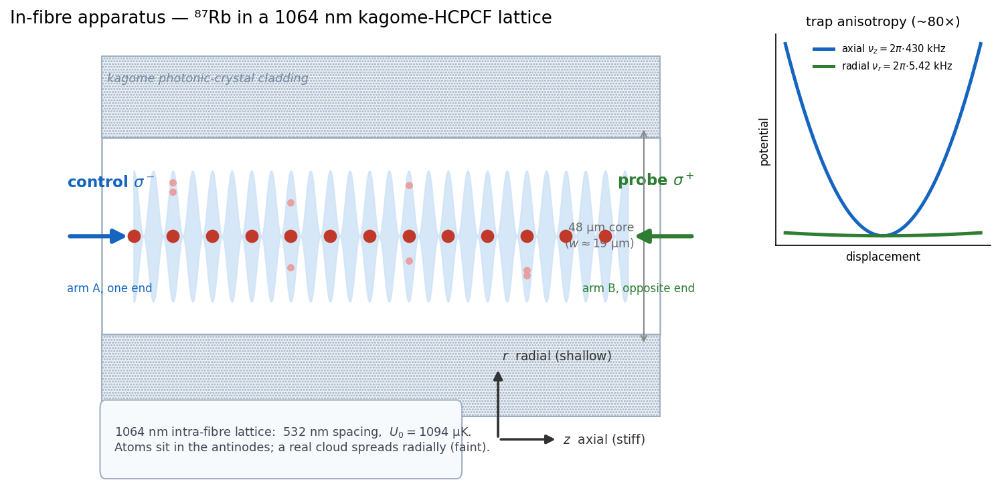
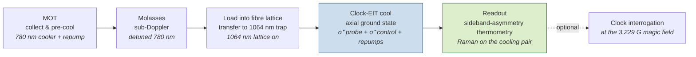

# 01 · Apparatus & the experimental sequence

*Where the atoms live, the trap that holds them, and the full shot from MOT to readout.*
[← Guide cover (README)](../../README.md) · [Next: the cooling scheme →](02_cooling_scheme.md)

---

## The fibre and the trap

The experiment happens **inside a hollow-core photonic-crystal fibre** — a kagome K19 HCPCF (XLIM
Limoges) with a 48 µm core, mode-field diameter ≈ 38 µm at 780 nm, giving a beam waist
**w ≈ 19 µm**. ⁸⁷Rb atoms are trapped in a **1064 nm optical lattice** formed by light sent down the
core, so the atoms sit in the antinodes of a standing wave threaded through the glass.

The trap is deliberately **anisotropic**, and that anisotropy organises the whole program:

| axis | trap frequency | character |
|---|---|---|
| **axial** ν_z (along the fibre) | 2π × 430 kHz | **stiff** — this is the mode we cool |
| **radial** ν_r (across the core) | 2π × 5.42 kHz | shallow (~80× weaker) and degenerate |

The single-photon Lamb–Dicke parameter is **η = 0.094** (well inside the resolved-sideband regime),
the lattice depth is U₀ = 22.8 MHz ≈ 1094 µK, and the spacing is 532 nm. Because the radial direction
is so much shallower, a real cloud samples a *range* of trap conditions across the core — that is the
radial-inhomogeneity story of [Chapter 06](06_cloud_floor_and_deadwall.md), and the reason the
field-insensitivity of [Chapter 02](02_cooling_scheme.md) matters so much.

*The atoms sit in the antinodes of the 1064 nm standing wave threaded down the hollow core; the
control (σ⁻) and probe (σ⁺) enter from opposite ends (the dual-end delivery of
[Chapter 03](03_laser_and_delivery.md)). The right panel is the point: the axial trap is ~80× stiffer
than the degenerate radial one, so a real cloud spreads radially and samples a range of trap conditions
— the radial-cloud story of [Chapter 06](06_cloud_floor_and_deadwall.md).*

## The full shot

A single experimental cycle runs through five phases. The first three are standard free-space
preparation that ends with atoms loaded into the in-fibre lattice; the last two are the physics this
project models — the clock-EIT cooling ([Ch 04](04_operating_point.md)–[05](05_axial_cooling_floor.md))
and the sideband-asymmetry readout ([Ch 07](07_thermometry_and_analysis.md)).

The cooling and readout reuse the **same** laser hardware (Chapter 03): the field-insensitive cooling
pair *is* the thermometry pair, so there is no separate "park-and-transfer" step before reading. The
magic 3.229 G field appears only in the optional final interrogation — **cooling happens at a relaxed
1.0–1.5 G**, because the cooling pair is field-insensitive at *any* field (Chapter 02).

## Why "in a fibre" is the point

Holding the atoms inside the fibre's own vacuum means the cold source can be **delivered along the
fibre** — one end in the chamber, the atoms conveyed metres away while never leaving the glass
envelope. The in-fibre physics is identical wherever along the core the atoms sit, which is what makes
out-of-chamber delivery an *architecture* choice rather than a new regime (master §12). The cost is the
shallow radial trap and the inhomogeneity it imposes — the price the rest of the guide pays attention
to.

---

**Go deeper →** the full pulse sequence on a single EOM is in
[`reference/delivery/single_EOM_sequence.md`](../reference/delivery/single_EOM_sequence.md) and
[`reference/delivery/full_sequence_config.md`](../reference/delivery/full_sequence_config.md); the trap
constants and system table are master [§1](../clock_EIT_consolidated.md).
