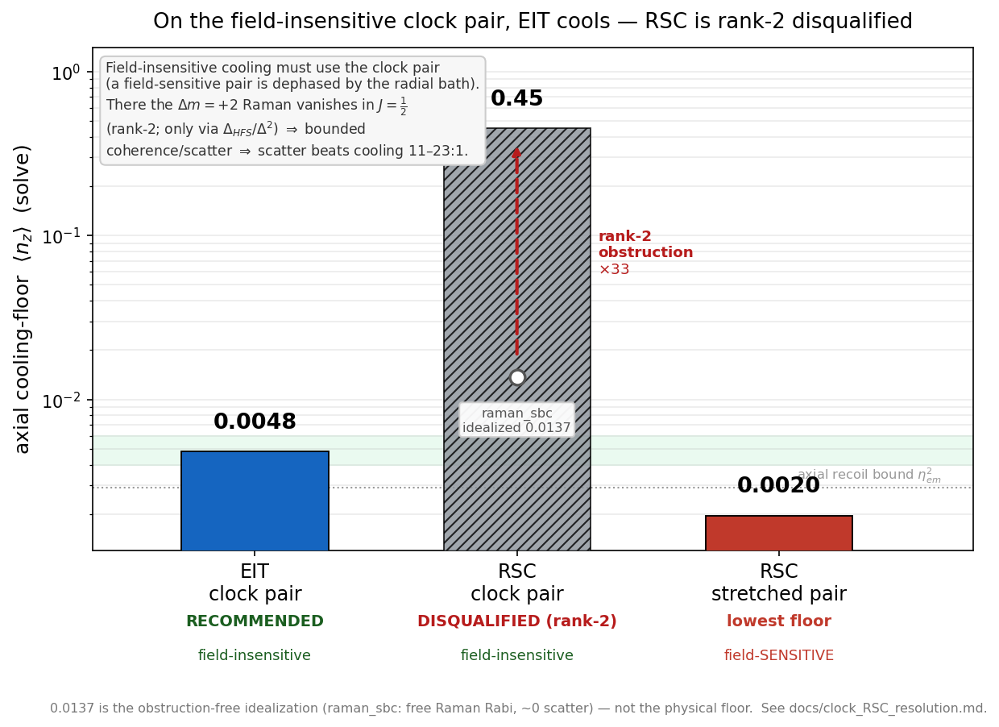

# 02 · The cooling scheme — why EIT, not Raman

*The clock-EIT Λ, the field-insensitive dark pair, and the obstruction that rules out the "obvious"
stretched-pair Raman alternative.*
[← Apparatus](01_apparatus_and_sequence.md) · [Next: laser & delivery →](03_laser_and_delivery.md)

---

## A Λ on a field-insensitive dark pair

Cooling runs on a **Λ system** on the D2 line in which *both* legs drive the **same** excited
sublevel **|F′=2, m′=0⟩**:

- **probe σ⁺**: |F=1, m=−1⟩ → |F′2, 0⟩
- **control σ⁻**: |F=2, m=+1⟩ → |F′2, 0⟩

The defining choice is the ground pair. Both legs have **g_F · m_F = +½**, so the differential Zeeman
shift of the two-photon dark superposition **vanishes identically — at any magnetic field.** The dark
resonance is therefore first-order field-insensitive, which is exactly what a cloud spread across the
shallow, degenerate radial trap (with its spread of B-field and light shift) needs: every atom stays
*dark* regardless of where it sits. This is why cooling can run at a relaxed 1.0–1.5 G and the
clock-magic 3.229 G field is reserved for interrogation only.

The cooling itself is **engineered sideband asymmetry**: the EIT bright resonance is placed so the red
(cooling) sideband is enhanced and the blue (heating) sideband is Fano-suppressed. The net asymmetry
*is* the cooling rate (the Liouvillian gap). Two practical settings make the scheme work — the
**weaker-probe lever** and the servoed two-photon detuning δ₂ — both covered in
[Chapter 04](04_operating_point.md).

One leg assignment is settled: **config A** (weak probe on |1,−1⟩, strong control on |2,+1⟩). The
reverse was tested in full and **rejected** — not for a diffusion reason but because the F=2-interior
dark leg of the swapped scheme cannot be cleanly repumped (master §10, Stage 9).

## Why EIT beats Raman sideband cooling on a cloud

Resolved-sideband Raman cooling (RSC) reaches a comparable *single-atom* floor, but it loses decisively
on a **cloud**, and for a structural reason worth understanding.

EIT's bright feature is **broad** (~150 kHz), so it stays resonant across most of the cloud — coverage
≈ **99 %** of a 100 µK cloud (r < 12.45 µm). An RSC sideband is **narrow** (~16 kHz), covering only
≈ **19 %** (r < 3.70 µm); the cloud-averaged ⟨n_z⟩ is ≈ 0.03 (EIT) versus ≈ 4 (RSC). To get RSC's
clean cycling you would cool on the **stretched m′=2 pair** — but that pair is field-*sensitive*, so
the radial B/light-shift spread dephases it. The field-insensitive m′=0 pair is the only one that
survives the cloud, and on it RSC's narrow sideband cannot compete.

## The rank-2 obstruction (and where it *does* bite)

There is a deeper reason the stretched-pair route is a trap. The field-insensitive Δm = +2 transition
|1,−1⟩↔|2,+1⟩ is driven by a **rank-2** (two-photon, Δm=2) process, whose two-photon Rabi frequency is
intrinsically weak (a figure-of-merit ≈ 5.6 versus 78–2474 for the ordinary Δm=0 vector pairs). For
*cooling* this is moot — EIT does not rely on that transition. But the same obstruction returns in
**[thermometry](07_thermometry_and_analysis.md)**, where the readout *does* drive the Δm=+2 pair: it
forces higher readout intensity and an intensity-ratio-dependent AC-Stark shift. This is exactly the
effect **Naber–Spreeuw (PRA 94, 013427, 2016)** measured and mitigated, and it is the subject of the
project's theory paper ("Paper T").

---

**Go deeper →** the EIT-vs-RSC resolution and the rank-2 argument are in
[`reference/scheme/clock_RSC_resolution.md`](../reference/scheme/clock_RSC_resolution.md); the
alternatives sweep (leg-swap, tripod, double-EIT, EIT↔RSC, D1) and why each fails is master
[§10](../clock_EIT_consolidated.md) and the Appendix on the F′=1 conceptual point.
