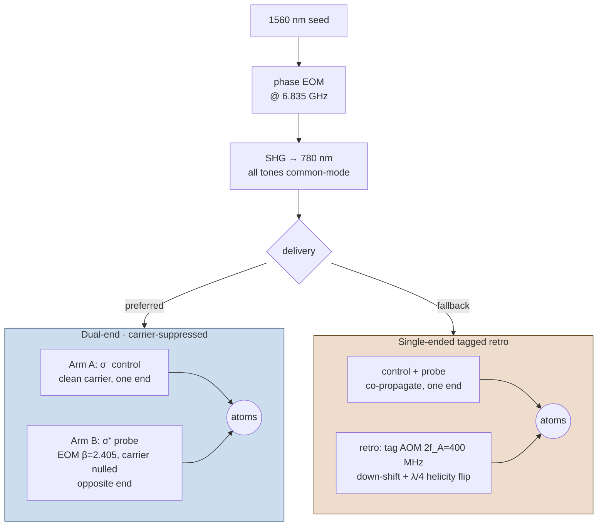
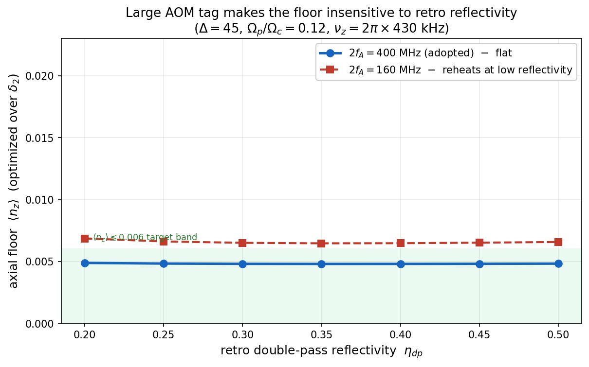

# 03 · Laser & delivery

*How every optical tone is generated from a single laser, and the two ways to get them to the atoms.*
[← Cooling scheme](02_cooling_scheme.md) · [Next: the operating point →](04_operating_point.md)

---

## One laser, all tones common-mode

The cooling pair is split by the **6.835 GHz** ground hyperfine, and the dark resonance is
first-order field-insensitive *only* if the probe–control two-photon detuning δ₂ is held to the dark
resonance (Chapter 04). Generating the two tones from independent lasers would put their relative phase
at the mercy of two laser linewidths. The architecture avoids that entirely: a **single 1560 nm seed**
is phase-modulated by **one EOM** at the hyperfine splitting, then frequency-doubled (**SHG**) to
780 nm. Every tone the atoms see is therefore a sideband of the *same* optical carrier — the
6.835 GHz spacing is set by an RF synthesiser, not by laser stability, so the two-photon detuning is
**common-mode stable** by construction.

## Two ways to deliver it

From there, two delivery topologies put the tones on the atoms. They realise the **same** atomic
operating point; the choice is set by vacuum access, not physics.

**(a) Dual-end, carrier-suppressed EOM — preferred.** Arm A carries the control (σ⁻, a clean direct
tone). Arm B carries the probe through a plain phase EOM driven to the **first J₀ zero (β = 2.405)**:
the carrier vanishes and the σ⁺ probe is the upper J₁ sideband, with every other sideband ≥ 6.835 GHz
off-resonance and harmless. The two arms inject from **opposite ends** of the fibre. No SSB modulator,
slave laser, or filter cavity is needed — that simplification was the key delivery correction of the
program (master, Stage 4). At the nominal operating point the arm-power split is ≈ **95:5** (A:B). Axial
floor **~0.005–0.006**.

**(b) Single-ended tagged retro — fallback** (if two-ended vacuum access is impractical). Control
carrier and probe sideband co-propagate into one end; a **double-passed tag AOM at 2f_A = 400 MHz**
down-shifts the retro-reflected return, and a **λ/4** plate in the retro arm flips its helicity. The
down-shift is essential — an up-shift would crash the rejected return-control into F′=3. Axial floor
**~0.0072**.

## The retro cap is a non-issue

A natural worry about the fallback is the retro reflectivity (AOM double-pass × re-injection into the
core). It turns out **not** to bind:

*(Figure pixels are **stale**: the plotted floor (~0.0049) is an old tagged_solver run; the canonical
single-tagged 2f_A=400 floor is **0.0072** — the values in the text below and `operating_point.md` §3. The
**flat-in-η_dp shape** it shows is the robust result; a magnitude-corrected regeneration is queued.)*

At a 400 MHz tag the floor is **flat in retro efficiency over 20–40 %** (0.0073 / 0.0072 / 0.0072),
because the tag pushes the amplified rejected-forward-probe scatter far enough off-resonance that it
washes out. Lower efficiency only forces a slightly larger EOM depth and nW-scale launch power — not a
floor cost and not a change of operating point. Use the 400 MHz tag and the retro cap stops mattering.

---

**Go deeper →** the all-fibre 1560 → SHG architecture and the dual-end-vs-retro trade are in
[`reference/delivery/laser_architecture_comparison.md`](../reference/delivery/laser_architecture_comparison.md);
the delivery tables and the retro-cap scan are master [§4](../clock_EIT_consolidated.md) and
[`operating_point.md` §3](../operating_point.md).
