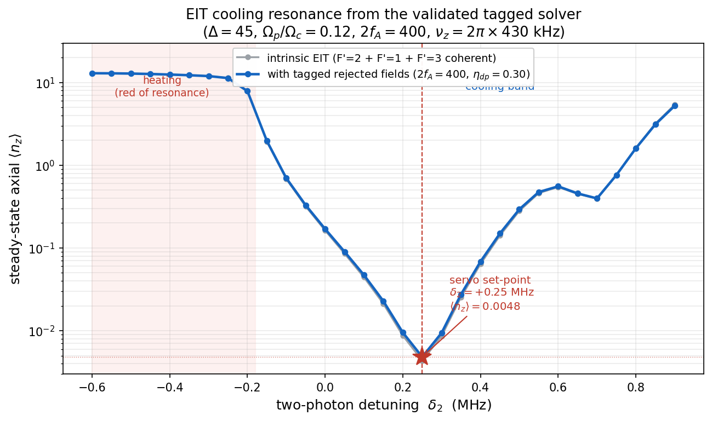
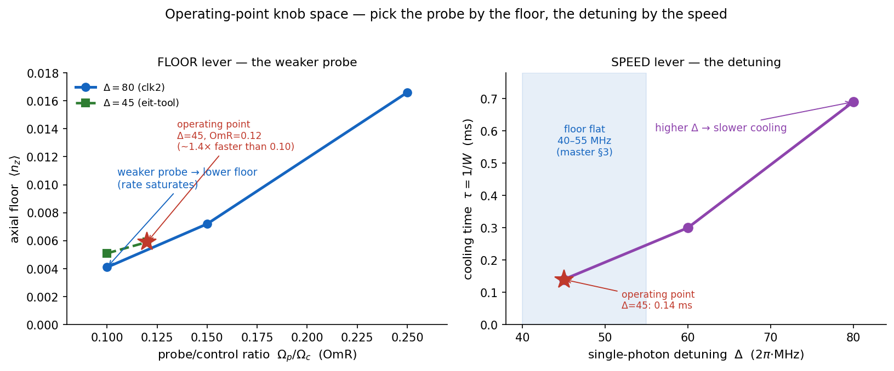

# 04 · The operating point

*The four settings that define how the cooler is run — and the one counter-intuitive lever that sets
the floor.*
[← Laser & delivery](03_laser_and_delivery.md) · [Next: the axial floor →](05_axial_cooling_floor.md)

---

## The four knobs

The atomic operating point is delivery-independent and fully audited
([`operating_point.md`](../operating_point.md), SSOT `src/operating_point.py`):

| knob | value | role |
|---|---|---|
| single-photon detuning **Δ** | **+45 MHz** blue (flat 40–55) | resonance placement; floor flat across the band, time + cloud favour the low end |
| probe/control ratio **Ω_p/Ω_c** | **0.12 nominal** (0.10 floor-optimal) | the floor/rate dial — see below |
| two-photon detuning **δ₂** | **servoed** ≈ −0.10 (dual) / −0.19 (single) | tracks the dark resonance; not hardcoded |
| cooling **B-field** | 1.0–1.5 G | any field works (pair is field-insensitive); magic 3.229 G is interrogation-only |

The total Rabi frequency is pinned to the EIT condition Ω_tot = √(4Δ·ν_z) ≈ 8.8 MHz, which fixes Ω_c
and Ω_p once the ratio is chosen. So the *ratio* — not the absolute Rabi — is the real lever.

## The weaker-probe lever (the non-obvious one)

The single most important and least obvious optimisation is this: **lowering the probe ratio Ω_p/Ω_c
lowers the floor, while the cooling rate saturates.** The Liouvillian gap (the cooling rate) flattens
at ≈ 0.0017 / 0.0024 / 0.0027 MHz for Ω_p/Ω_c = 0.11 / 0.18 / 0.25, while the floor keeps dropping as
the probe weakens. The optimum therefore sits at **weak probe**, not at a "balanced" Λ.

This makes Δ and Ω_p/Ω_c **decouple on purpose**: pick the probe ratio by your cooling-*time* budget,
then read the floor off the ratio you chose. The repo runs **OmR = 0.12** because it cools ~1.4× faster
than 0.10 for a floor cost that is negligible (both > 99.4 % ground state). An earlier "balanced"
operating point (Δ=80, OmR=0.25) was **3.5× worse** on the floor — it had only ever scanned the control
*up*, missing this lever entirely.

## The δ₂ servo and a sign-convention warning

The floor has a shallow optimum in δ₂ that is **slightly negative** — ≈ −0.10 MHz (dual-end) /
−0.19 MHz (single-ended) in the **canonical field convention** (δ₂ = probe − transition) — because it
tracks the ≈ −0.2 MHz Stark shift of the dark resonance. It **drifts with optical power and radial
position and must be servoed**, never parked at the bare hyperfine splitting.

> **Convention trap (this bites everyone once):** the validated `tagged_solver.py` parameterises the
> *state energy* instead, so it reports the **same** servo point with the **opposite sign** (its
> optimum is d2 = +0.20). Same physics. Always quote δ₂ negative in the field convention — see
> [INDEX §3](../../INDEX.md). The on-figure annotation here predates the v17 convention pass; trust the
> text and the SSOT, and a refreshed figure is queued.

*The two levers, decoupled. **Left:** the floor drops as the probe weakens (the weaker-probe lever) at
both Δ=80 and Δ=45, while the cooling rate saturates — so weak probe is floor-optimal. **Right:** the
floor is flat across Δ=40–55, but the cooling *time* rises steeply with Δ — so operate at the low end.
Pick the probe by the floor budget, the detuning by the speed budget.*

---

**Go deeper →** the operating point, the weaker-probe scan, and the retro-cap optimisation are in
[`operating_point.md`](../operating_point.md) (SSOT `src/operating_point.py`); the cooling-dynamics
levers (rate-vs-Δ, the saturation) are master [§6](../clock_EIT_consolidated.md).
