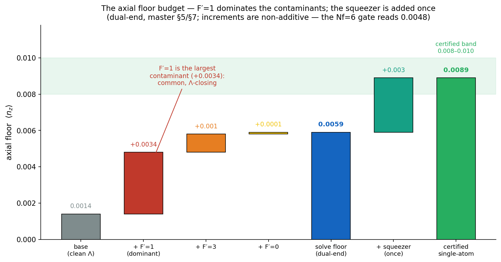

# 05 · The axial cooling floor

*The single-atom result: how low ⟨n_z⟩ goes on the trap axis, and what sets the limit.*
[← Operating point](04_operating_point.md) · [Next: the cloud floor →](06_cloud_floor_and_deadwall.md)

---

## A solve that carries every excited level

The axial floor is computed by a **multilevel QuTiP steady-state solver** (full Breit–Rabi ground
manifold, tensor-diagonalised 5P₃/₂ with all four hyperfine levels F′ = 0–3, full Clebsch–Gordan
dipole ladders, a multi-rotating frame, recoil, and full decay branching). It returns the steady-state
⟨n_z⟩ directly. Crucially it carries **all** the off-resonant excited levels coherently, not just the
named EIT level — and that turns out to matter.

## Why F′=1 dominates the budget

EIT is a *two-photon* resonance: there is **one** transparency window, fixed by the two laser
frequencies and the 6.835 GHz ground splitting, regardless of which excited level is the intermediate.
Of the four 5P₃/₂ levels, **two are "common"** (reachable from both legs): the named F′=2, and **F′=1**.
The F′=2-dark superposition does **not** simultaneously cancel its F′=1 coupling (the dipole ratios
mismatch), leaving a residual dark-state coupling to |F′1,0⟩ of −0.31 — full strength, suppressed only
by its ~212 MHz detuning. That residual is the **largest single contaminant**:

| component | floor | increment | character |
|---|---|---|---|
| base (clean Λ, no F′0/1/3) | 0.0014 | — | dark-state + recoil limit |
| **+ F′=1** | **0.0048** | **+0.0034** | **dominant** — common, Λ-closing |
| + F′=3 | (within) | +0.0010 | secondary, control-only |
| + F′=0 | (within) | +0.0001 | negligible, probe-only |

The increments are **non-additive** (F′=1 dominates), and the floor is **recycle-limited**: per leak
event the repumper runs ~7 cycles, so it is the recycle recoil — not the cooling or the leak — that
sets the ~0.005 number. (This was discovered as a pair of compensating errors that happened to cancel —
master Stage 8 is worth reading as a methods lesson.)

*The floor built up step by step: from the clean-Λ base (0.0014), F′=1 adds the dominant +0.0034, with
F′=3 and F′=0 minor, to the dual-end solve floor (~0.0059 converged; the Nf=6 gate reads 0.0048). The
once-only transient squeezer (+0.003, next section) takes it into the certified band 0.008–0.010.*

## No excited-state anti-trap

A real risk at 1064 nm would be the lattice *anti-trapping* the excited state and wrecking the cooling.
It does not: the cooling sublevel **|F′2, 0⟩ has a pure scalar shift of +38.1 MHz** — its F′=2
hyperfine tensor term vanishes identically (a 6j zero), so the shift is geometry-independent. The
steady excited state is untrapped. Each brief 5P₃/₂ excursion does see the inverted curvature, which
**squeezes** the wavepacket — a *transient* heat term of ≈ **0.003**, added **once**. (This same scalar
shift drives the radial detuning shift of [Chapter 06](06_cloud_floor_and_deadwall.md).)

## The certified single-atom floor

Putting it together under one budgeting convention (the solve is "traffic-in / potential-out"; add the
transient squeezer ≈ 0.003 once):

> **Solve floor** ~0.005–0.006 dual-end / ~0.0072 single-ended tagged **+ 0.003 squeezer (once)**
> ⇒ **certified single-atom ⟨n_z⟩ ≈ 0.008–0.010** — **> 99 % axial ground-state population.**

A previously-quoted all-in band of 0.012–0.019 was a **double-count** and is withdrawn; quote the
0.008–0.010. The canonical floor table — every value with its convergence tier and the solver that
produces it — is **[INDEX §1b](../../INDEX.md)**. Reproduce it yourself with
`python src/engines/eit_cooling_tool.py --regression` ([Chapter 08](08_running_and_optimizing.md)).

---

**Go deeper →** the full floor budget, the qutip-5 re-pin, and the recycle-limit argument are master
[§5–§7](../clock_EIT_consolidated.md); the F′=1 conceptual point in full is the master Appendix; the
anti-trap and excited-state polarizability are
[`reference/excited_state/polarizability_5P32_1064.md`](../reference/excited_state/polarizability_5P32_1064.md)
and [`reference/floor/ANTITRAP_RESOLUTION.md`](../reference/floor/ANTITRAP_RESOLUTION.md).
