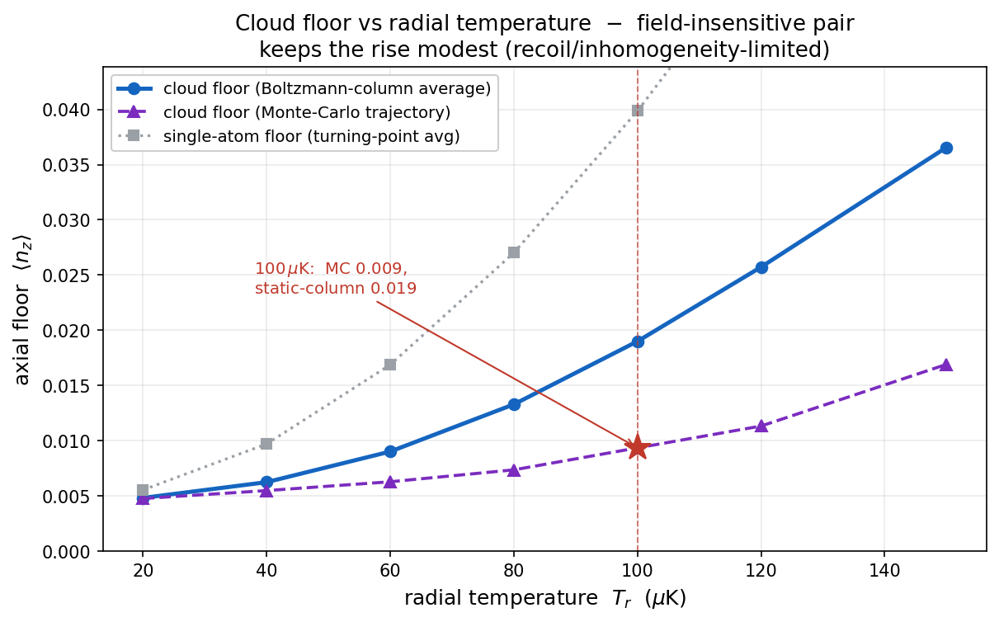
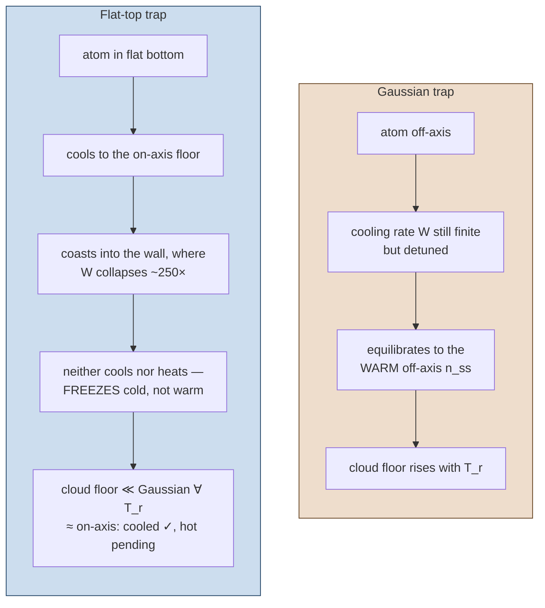
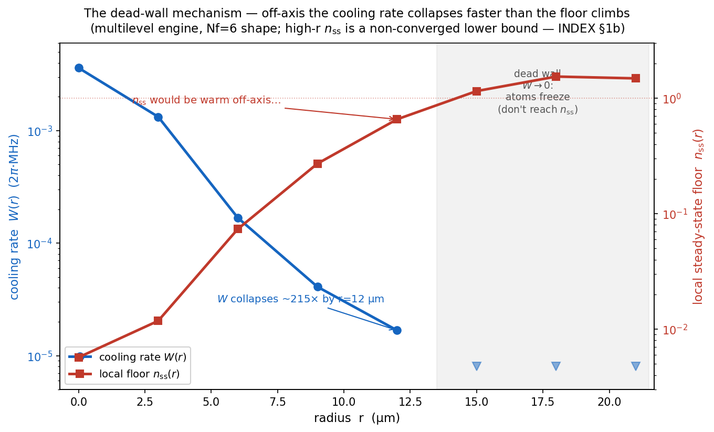

# 06 · The cloud floor & the dead-wall

*From one atom on the axis to a whole cloud across the core — why the trap *shape* matters more than
its temperature, and an honest account of which numbers are settled.*
[← Axial floor](05_axial_cooling_floor.md) · [Next: thermometry →](07_thermometry_and_analysis.md)

---

## The cloud samples a range of traps

Chapter 05 cooled one atom on the axis. A real cloud spreads across the **shallow, degenerate radial
trap** (Chapter 01), so different atoms sit at different radii r and see different trap conditions. The
scaling laws (with s(r) = exp(−2r²/w²)) are:

- ν_z(r) = ν_z0·√s, η(r) = η0·s^(−¼), Ω(r) = Ω0·√s, and
- **Δ_eff(r) = Δ₀ + c·(1−s), c = 60.9 MHz** — a radial *detuning* shift (the "M3" term) that the early
  radial passes missed entirely. It follows from the +38.1 MHz scalar shift of |F′2,0⟩ (Chapter 05)
  and is what degrades cooling off-axis beyond ~50 µK.

Because the inhomogeneity the cloud samples is set by k_BT_r/U₀ — the radial *temperature* over the trap
depth — the cloud floor is **T_r-gated**: cooler radial mode → tighter sampling → lower floor.

*The cloud floor rises with radial temperature, and the realised (dynamic Monte-Carlo) floor sits below
the quasi-static estimate. The on-figure annotation is an older 3-level metric; current canonical
numbers and tiers are in [INDEX §1b](../../INDEX.md), and a refreshed figure is queued.*

## The dead-wall: why a flat-top freezes the edge cold

The one structural lever that removes the T_r gating is a **flat-top 1064 profile**. A different waist
or fibre type cannot help (the sampling is waist-independent); only flattening the Gaussian curvature
removes the ν_z(r)/Δ_eff(r) variation at its root. The mechanism is subtle and worth understanding —
the **dead-wall effect**:

In a Gaussian trap an off-axis atom equilibrates to the *warm* local steady state. In a flat-top, an
atom cools to the on-axis floor in the flat bottom and then **coasts frozen through the confining
walls** — because the cooling rate W(r) collapses off-axis, the diffusion W·n_ss vanishes, so the atom
neither cools further nor heats back up. The flat width (coverage) governs the cooling *rate*, not the
floor; flatness governs the floor. This is the single largest mover in the program, and the one
off-desk ask (a flat-top mode-content feasibility study, XLIM/Marchesini).

*The dead-wall in one plot (multilevel engine, Nf=6 shape). The cooling rate W(r) (blue) collapses
~215× by r = 12 µm and then falls below resolution (→0, the shaded zone); the local floor n_ss(r) (red)
climbs past 1. Off-axis, an atom would *equilibrate* to the warm n_ss only if W stayed finite — but W
collapses first, so the atom freezes at whatever cold value it brought in. (The high-r n_ss magnitude
is a non-converged lower bound — INDEX §1b; the **shape** here, which is what drives the mechanism, is
Nf-robust.)*

## What is settled, and what is still converging

This is the chapter's most important paragraph. The **cloud × multilevel union** runs the validated
axial engine (Chapter 05) on a radial grid and feeds it through the dead-wall Monte-Carlo — computing
the cloud floor on the headline engine, **not** assembling it from estimates. The result splits into
three distinct epistemic statuses; do not flatten them into one:

1. **Cooled-cloud floor — SETTLED and citable ≈ 0.0072** (100 µK box, Fock-converged: only +1.4 % from
   Nf=6 to Nf=8). This is a real, quotable number.
2. **The flat-top *mechanism* — holds qualitatively** at every radial temperature: the flat-top
   collapses the cloud floor far below a Gaussian. The *lever* is robust.
3. **Every hot-cloud *figure* — a non-converged lower bound**, pending a cluster run. The uncooled box
   floor is **≥ 0.021 (at Nf=8) and rising** (drift +79 % from Nf=6 to Nf=8 and growing). The earlier
   Nf=6 value of 0.0118 was itself **under-resolved** and is **retracted** — Nf=6 failed to resolve the
   very off-axis radii (n_ss > 1 beyond r ≈ 12 µm) that dominate the hot-cloud weighting.

> **The through-line, stated honestly:** *The cooled-cloud axial floor is 0.0072 (100 µK,
> Nf-converged, computed not assembled). The uncooled hot-cloud floor is not yet converged on available
> hardware (≥ 0.021 at Nf=8, drift +79 % and growing) → cluster-pending. The flat-top mechanism
> collapses the cloud far below a Gaussian at every T_r (the lever holds qualitatively); "collapses to
> ≈ on-axis" holds only for the cooled cloud.*

The uncooled digit will settle once the hot-box floor's successive-Nf drift falls below a few percent
at those off-axis radii (which needs Nf ≫ 8 — a cluster job). This is a textbook instance of the
project's recurring methods lesson: **a number is not trustworthy until the instrument that produced it
has demonstrated it resolves the regime that dominates the number** ([INDEX §3](../../INDEX.md)).

---

**Go deeper →** the radial program, the dead-wall MC, and the flat-top result are master
[§8](../clock_EIT_consolidated.md); the audited findings are in
[`reference/radial/`](../reference/radial/) (radial inhomogeneity, dynamic-MC and squeezer-integral
audits, flat-top feasibility, flatness spec); the canonical cloud row with tiers is
[INDEX §1b](../../INDEX.md).
