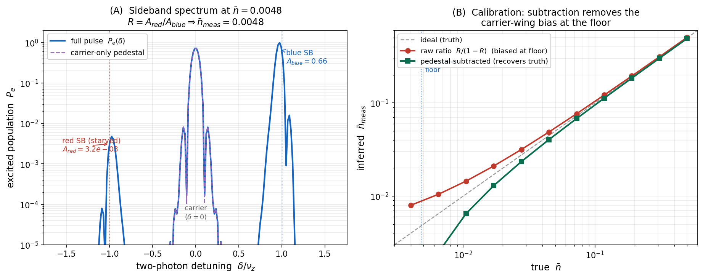

# Thermometry — sideband-asymmetry readout of ⟨n_z⟩ (consolidated authority)

*The single authoritative discussion of how the cooling result ⟨n_z⟩ is **measured**. Method →
results → readout spec → open items. Engine: `src/thermometry.py` (v0.2.0); figure:
`figures/fig_thermometry.py`. Tags: **[V]** computed/derived, **[I]** inference, **[O]** open.*

> The cooling floor is worthless if ⟨n_z⟩ cannot be read without bias at the 0.01 level (half the
> floor). This doc establishes the readout **physics** that makes that achievable — one
> already-present laser, a shaped pulse, a calibration — and flags the validation that still gates a
> *measured* number: the live readout is on the **Δm=+2** pair |1,−1⟩↔|2,+1⟩, whose transition-specific
> spectral environment is **relabeled from the Δm=0 audit, not re-derived** (§2 scope, §5 item 1).

---

## 1. Method

After cooling, read ⟨n_z⟩ by **resolved-sideband Raman spectroscopy on the cooling pair itself**,
|F=1,m=−1⟩ ↔ |F=2,m=+1⟩, through the bare-mirror retro path used for cooling (one nm-stabilized
mirror, double-duty).

- **No park→read transfer.** In the settled **m′=0 clock, config A** scheme the cooling pair *is*
  the field-insensitive pair (both g_F·m_F = +½ ⇒ first-order B-insensitive at any field, CLAIMS
  B1), so the thermometer reads it **directly** — there is no microwave/RF transfer step. *(This
  supersedes the earlier park→read |1,−1⟩→|1,0⟩ / read-on-|1,0⟩↔|2,0⟩ scheme; see Provenance.)*
- **The readout is Δm=+2.** |1,−1⟩→|2,+1⟩ raises m by 2 ⇒ a two-photon Raman on the QWP-retro
  (Δm=±2) path, **not** the bare-mirror Δm=0 path of the superseded m=0 readout. The coherent
  sideband problem is the same 2-level⊗Fock, but the *spectral neighborhood* (nearby resonances,
  AC-Stark) is this pair's — which is exactly what is **not** yet validated for it (§2 scope, §5).
- **Geometry.** Counter-propagating 2k Raman along the fibre (= the cooling axis) ⇒ measures the
  **axial** mode that was cooled, with effective Lamb-Dicke parameter **η_R ≈ 2η_z ≈ 0.187** —
  ~2× the cooling η_z=0.094, so sideband coupling is *stronger* than for cooling (favourable for
  contrast). **[I/V]**
- **Frequencies.** The Raman pair is split by the 6.835 GHz ground hyperfine (EOM-generated,
  clock-referenced), scanned about the carrier; red (n→n−1) and blue (n→n+1) sidebands at ∓ν_z =
  ∓430 kHz.
- **Observable.** Red/blue amplitude ratio **R = A_red/A_blue**. After good cooling the red sideband
  is suppressed (Leong-type spectrum). ⟨n⟩ is recovered from R **by calibration** — see §2/§3; do
  **not** use the naive ⟨n⟩ = R/(1−R) (it is biased ~3× at small Δ, §2).

The method itself is standard and demonstrated for trapped Rb in fibre/tweezers (Leong 2020 HCPCF;
Chiu 2025; Rensburg 2025). What is established *here* is its fidelity **in this geometry, under the
tagged delivery**.

---

## 2. Results (computed — `thermometry.py`)

> **Validation scope (read first).** These run on the **generic two-level⊗Fock sideband core**, with
> g,e **relabeled** to the m′=0 pair. They are **transition-agnostic** — pulse shape (the pedestal,
> Blackman), 2k recoil, standing-wave phase, and the *generic* `π·Γ/Δ` scatter — so they **carry [V]**
> to the Δm=+2 readout. They do **not** contain the |1,−1⟩↔|2,+1⟩-**specific** spectral environment
> (the Fano background of *its* nearby resonances, the red/blue AC-Stark balance across *its* scan):
> that is **relabeled, not re-derived → open [O]** (§5 item 1). So "[V]" below means *transition-agnostic*.

- **Pulse shaping kills the dominant bias.** A finite **square** π-pulse leaks **0.39%** of the
  carrier into the sideband (≈ the 0.43% signal at the floor → ~2× bias; this is the +0.010
  finite-pulse pedestal of the original audit). A **Blackman-shaped** sideband-π pulse suppresses the
  carrier wing to **6×10⁻⁹** — with Blackman, R reads ⟨n⟩ faithfully and **independently of Δ**.
- **Scatter cancels in the ratio.** Off-resonant single-photon scatter on the sideband-π probe is
  ~13%/pulse at Δ=0.8 GHz, ~2.5% at 4 GHz, but is *uniform* across red and blue ⇒ **cancels in R**
  (verified as a gate: uniform scatter leaves R invariant).
- **Branching-resolved re-entry → a calibratable offset.** A scatter event re-enters the detected
  state |2,+1⟩ with P(g→e)≈0.10, P(e→e)≈0.21 (recoil 0.012 phonons/scatter). The master-equation
  result is a **near-constant pedestal on R** (≈ +0.009 at the floor) that **preserves dR/d⟨n⟩** —
  so a **calibration absorbs it**. The naive R/(1−R) is biased ~3× at 0.8 GHz, and off-sideband
  subtraction *over*-subtracts ⇒ **calibrate R against known ⟨n⟩; never naive R/(1−R), never
  off-sideband subtraction.**
- **Standing-wave phase cancels.** The retro Raman first sideband ∝ sin θ on **both** red and blue,
  so it cancels in R: the extracted ⟨n⟩ is **θ-independent** (contrast ∝ sin²θ is an SNR knob only,
  antinode θ=π/2). The cooling-optimal mirror phase therefore does not conflict with readout —
  "one mirror, double-duty" holds. **[V]**
- **Common-mode shifts cancel.** The 1064 differential scalar F=1↔F=2 (≈1.9 kHz) and the balanced
  clock-carrier AC-Stark shift both sidebands equally ⇒ cancel in R to first order. **[V]**
- **Direct P₀ readout.** A blue-sideband Rabi-flop + fit recovers P₀ to **±5%** at any Δ≥0.8 GHz with
  ~2000 shots — shot-noise-limited, not Δ-limited. **[V]**

---

## 3. Readout spec (what to set on the bench)

- **Pulse:** Blackman sideband-π. Probe strength s = Ω₀/ν_z sets the duration (s=0.12 → t_π≈52.7 µs;
  s=0.5 → 12.7 µs) — Blackman decouples the carrier-leak constraint, so larger s (shorter pulse) is
  fine. Keep the feature linewidth Γ_R ≈ 1/t_π ≪ ν_z=430 kHz so carrier and sidebands stay resolved.
- **Extraction:** calibrate R vs known ⟨n⟩ (the pedestal is absorbed); read P₀ from a BSB Rabi-flop.
- **Radial temperature:** keep **T_r ≲ 100 µK** so the axial sideband stays sharp (≤19 kHz Doppler
  spread vs the 20–80 kHz pulse bandwidth). This is the same T_r the cloud floor wants (INDEX §4).
- **Laser:** the single cooling laser is **sufficient** for calibrated ratio thermometry. A dedicated
  ~4 GHz thermometry laser is a **~2× shot-count (SNR) upgrade, not a requirement.**

---

## 4. What backs the numbers

`src/thermometry.py` (the **generic** coherent two-level⊗Fock core — gates: weak-probe recovers ⟨n⟩,
Nf-stable, uniform-scatter-leaves-R-invariant — with g,e **relabeled** to the m′=0 pair, so it carries
the transition-agnostic §2 results but **not** the Δm=+2-specific spectral environment, §5) +
`figures/fig_thermometry.py`. The detailed
falsification audit — the [O1]–[O4] closure, the m′=2→m′=0 reconciliation, the literature precedent
— is in **`thermometry_findings.md`** (retained as the audit of record; its readout-pair/park-step is
superseded by §1 here). The laser/delivery context is in **`architecture_delivery_thermometry.md`**.

---

## 5. Open items **[O]**

1. **The load-bearing gap: the rank-2-amplified intensity-ratio differential Stark on the Δm=+2 pair.**
   The §2 results carry (transition-agnostic: pulse-shape pedestal, Blackman, recoil, phase). The real
   gap is **not** generic "simulate the neighborhood," and **not** purely inherited — it is one
   intrinsic, *amplified*, already-documented systematic:
   - **Intrinsic + amplified.** The Δm=+2 readout carries a strong **intensity-ratio-dependent
     differential AC-Stark**, *worse* than on the Δm=0 vector pair: the rank-2 null makes the
     two-photon Rabi weak (FoM ≈ 5.6 vs 78–2474 for Δm=0, `papers/novelty_findings.md` T1), forcing
     higher readout intensity → larger single-beam shifts whose imbalance *is* the differential shift.
     **Naber–Spreeuw, PRA 94, 013427 (2016)** [arXiv:1605.05230] measured exactly this on
     |1,−1⟩↔|2,+1⟩: the frequency is highly intensity-ratio-sensitive, the differential shift
     **vanishing at an optimal ratio** (the linewidth narrows there — a built-in diagnostic). Being
     intrinsic to the readout beams, it survives perfect field extinction ⇒ **the** thing to validate.
   - **The null does *not* disqualify the readout** (unlike cooling): a single π-pulse tolerates the
     per-pulse scatter that *cumulative* cooling cannot. Its only readout effect is to amplify the
     differential Stark above — which Naber both characterized **and mitigated** (the optimal ratio).
   - **Residual.** Calibration absorbs *constant* offsets, but this shift is **scan-asymmetric** (a
     balance-dependent carrier shift detunes the fixed-frequency red and blue pulses *unequally*) ⇒ it
     does not calibrate out, and it **pins the operating point to Naber's optimal ratio**, off which it
     is not small.

   **Gap-closer (concrete, published-number bar).** A multilevel Δm=+2 readout sim — carrying **both**
   F′=1 and F′=2 + the σ⁺/σ⁻ pair (the two-path structure the generic core lacks), scanning the
   intensity ratio — must **reproduce Naber's optimal-ratio differential-shift null**, then confirm the
   red/blue amplitude asymmetry sits below the floor at that ratio. The bar is *hitting a published
   result*, not an uncharacterized neighborhood; independent of the cloud grid (a relabel-rerun can't
   produce it). **This is the single computation between "thermometry consolidated" and "verified."**
2. **[O3] field isolation during the readout window** *(the external, inherited-open sub-mechanisms).* Residual control (near F=2→F′2) leaking via the
   tag AOM / EOM carrier AC-Stark-shifts and scatters on the read states, biasing R. If readout
   **extinguishes** the cooling fields and applies a separate Raman, this is an **extinction** spec
   (AOM off-ratio, EOM carrier suppression); if it **retunes the same σ⁺/σ⁻ beams**, it is instead a
   **retune-isolation** spec (suppressing the wrong-leg copies during readout) — a different question.
   Set whichever the chosen readout implies.
3. **Recoil-resolved re-entry** — add the 3-point recoil to the re-entry-to-|g⟩ channel to confirm it
   stays ≪ signal (expected not to change the calibration conclusion).
4. **θ-Stark rebaseline (v0.3.0)** — the θ-aware tensor-Stark referencing of the operating point will
   shift the repump/contaminant detunings; re-baseline the readout detunings against it.

---

## Provenance & supersession

- Results (pulse shaping, scatter cancellation, branching pedestal, calibration, BSB fit): computed
  in `src/thermometry.py` v0.2.0; figure `figures/fig_thermometry.py`.
- **Superseded:** `thermometry_sim.py` / `thermometry_phase.py` (the earlier *swapped m′=2* model:
  cool in a field-sensitive pair, park in |1,+1⟩, transfer to read on |1,0⟩↔|2,0⟩). The current
  m′=0 scheme reads the cooling pair directly — `thermometry.py` is the live engine. The
  park→read framing still present in `thermometry_findings.md` is from that earlier model and is
  superseded here; its physics conclusions (pedestal, scatter/θ cancellation) carry over unchanged.
- Method precedent: Leong 2020 (HCPCF), Chiu 2025, Rensburg 2025. The Δm=+2 magic-pair Raman itself
  (the rank-2 null + the intensity-ratio AC-Stark null on |1,−1⟩↔|2,+1⟩): **Naber–Spreeuw, PRA 94,
  013427 (2016)** [arXiv:1605.05230] — also Paper T's prior art (`papers/novelty_findings.md` T3).
